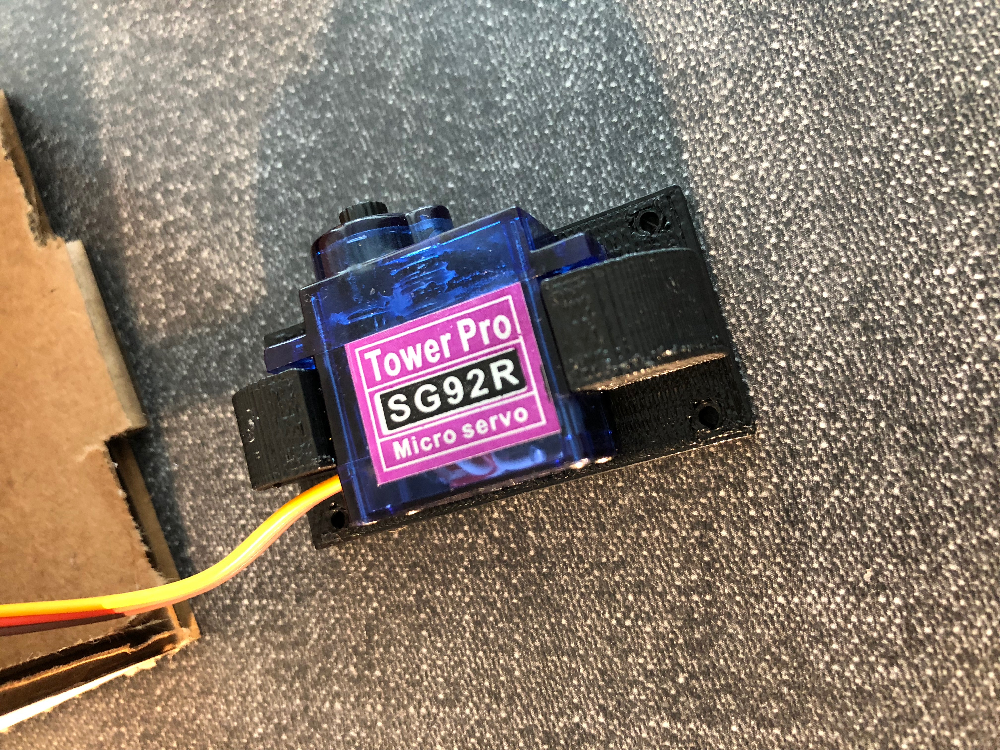
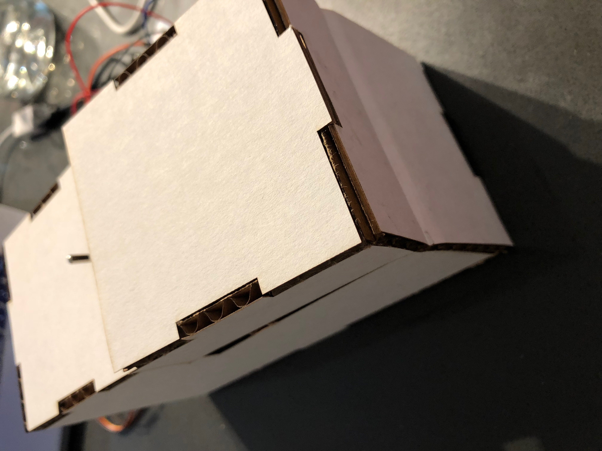
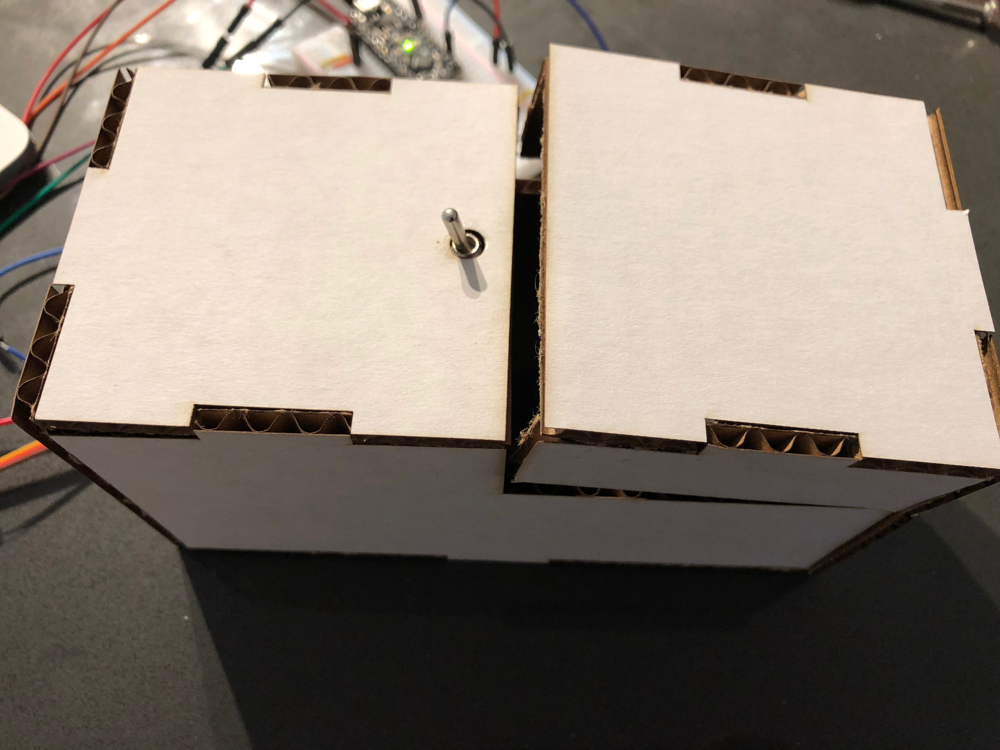
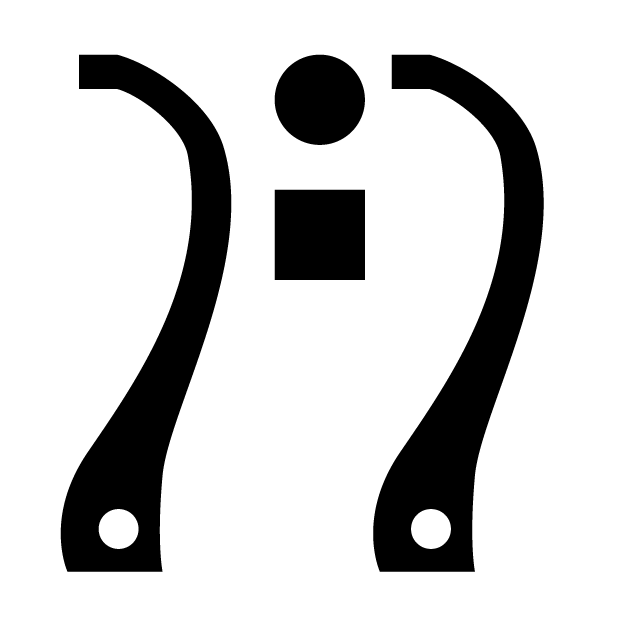
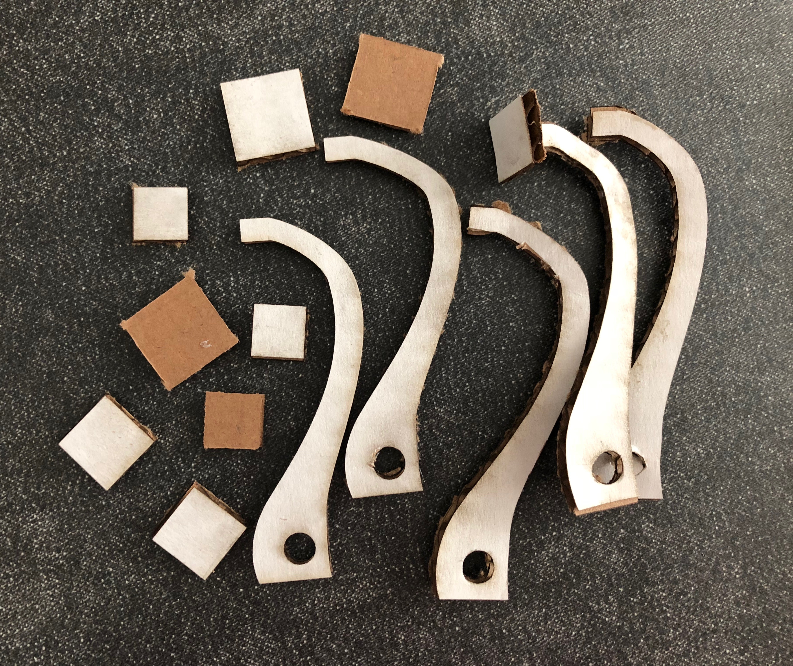
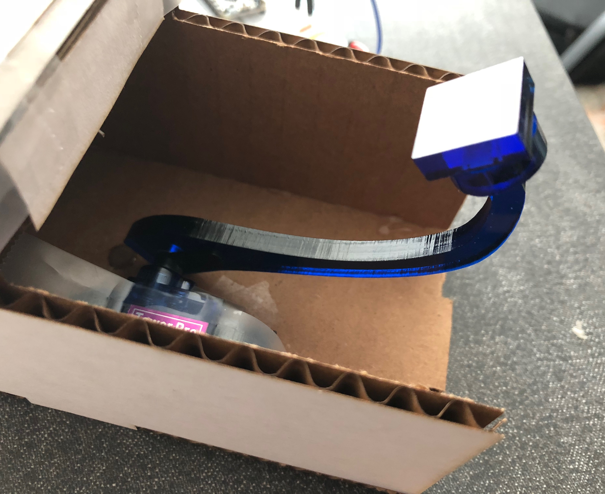
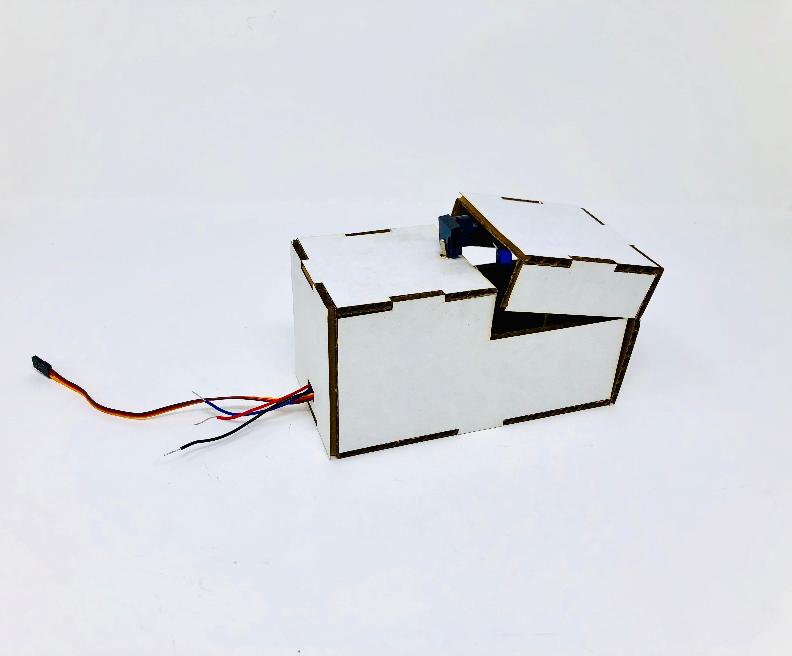
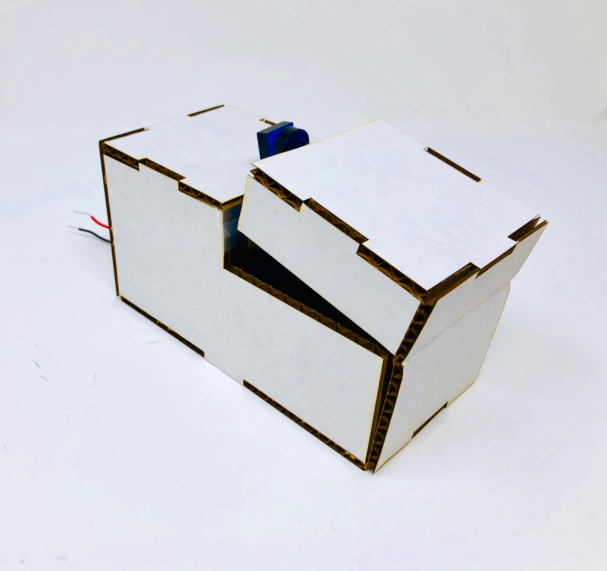

# Useless Box

*A lab report by Devon Bain*

## 3D Printing

**a. Include a photo of your printed part here.**

**b. Include `.stl` or `.svg` files for your bopper, if 3d-printing.**

I used laser cutting to make the bopper. See below for images and links.

## Laser Cutting

**b. Include a photo of your box here.**

## Electronics

**c. Upload code & a photo of your electronic circuit here.**

I used the first piece of provided code to test the switch: [Link to code](scripts/switch-test/switch-test.ino)

## Putting it All Together

Include here:

1. Your Arduino code.

[Link to code](scripts/uselessbox/uselessbox.ino)

I made two main changes to the code: first, I added a delay of one second before the bopper flips the switch. Second, I incremented the servo position with a loop when the bopper is coming up, rather than flipping immediately to the other position, because this prevented the box lid from getting stuck.

1. `.stl` or `.svg` files for your "bopper" — if you use some other technique, include the respective supporting material.

I used laser-cutting to make the bopper. It consists of a curved arm connected to the servo, which I placed on the bottom of the box, and a flat piece that pushes against the switch.

[Link to .svg \(exported from original .ai\)](img/bopper.svg)

The final pattern I used looks like:

I prototyped different shapes and curvatures with cardboard before cutting the final design with a stronger material - acrylic. 

For the attached part that pushes the switch, I cut both a round and square piece, but found that both in combination actually worked best.

1. At least one photo of your useless box taken in the MakerLab's Portable Photo Studio (or somewhere else, but of similar quality).

1. A video of your useless box in action.

(Link to video)[https://www.youtube.com/watch?v=ovpZIHjSnVU]
